# Library-of-books
### Installation
- Firstly, install laravel 6 and all extensions https://laravel.com/docs/6.x .
- secondly, install apache and mysql or install lampp .

### To Run App
- open lampp ,start apache and mysql.
- In cmd run --> composer install.
- In cmd run --> php artisan migrate.
- run server using command --> php artisan serve 

### Authentication
- The user can Register using facebook
- You can't view your profile before confirm your mail (mailtrap server)
- You can reset your if you forget it (mailtrap server) 
- The User can Upload Profile Image
- The user can Login using facebook
- After Rigister or Login you will redirect show admin dashboard if you admin or show user dashboard if you user
- Users can't redirect to any page without login
- User can see his name and profile image in navbar
- User can edit his profile

### Admin Chart
- Admin can add new category and delete , update it and view all category
- Admin can add new book and delete , update it and view all books
- Admin can list all user and make anyone admin and can deactive user profile
- Admin can list all admin
- Admin can edit his profile 
- Admin can view chart to show profit every week

### User DashBoard
- User can show all books.
- User can search about book by name or author
- User can filter book by latest or max rate
- User Can Filter Book According TO Category Name
- User can lease book and show books that made lease.
- User Can Add Book To His Favorite (Using Ajax)
- User Can Delete Book From His Favorite (Using Ajax)
- User can view his favorite books
- User can view book
- User can add Comment and delete his comment only 
- User can add rate to the book
- User can show related books
- User can edit his profile

###############################

### -Authentication Images
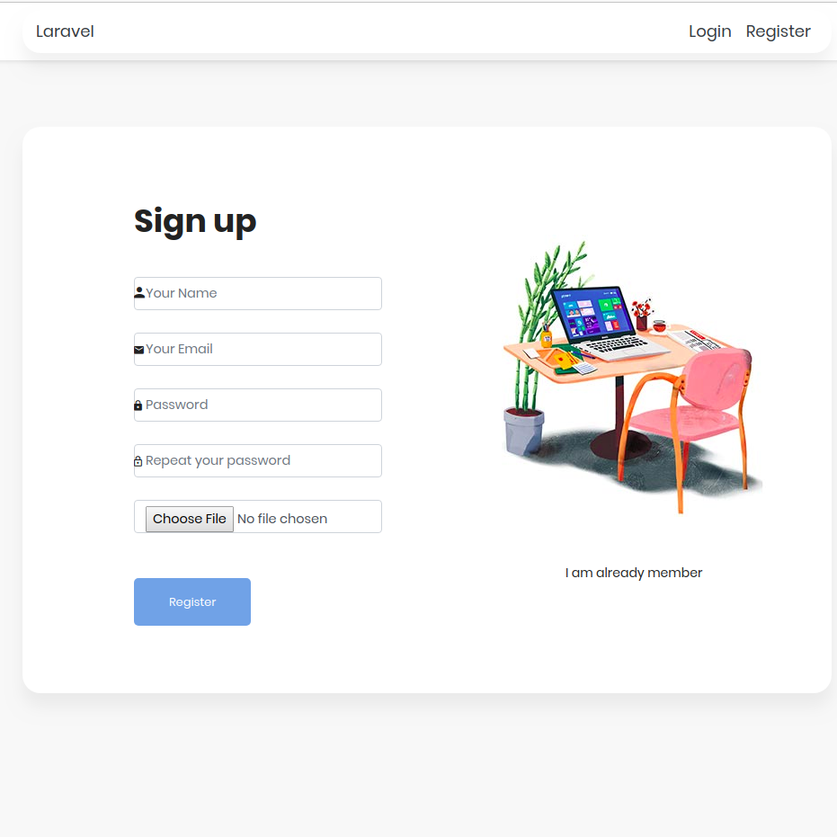
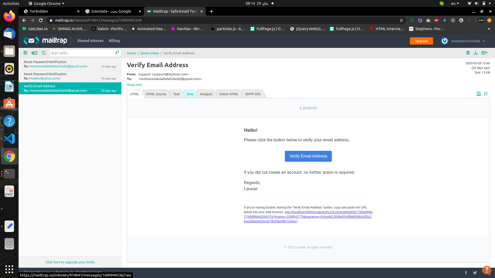
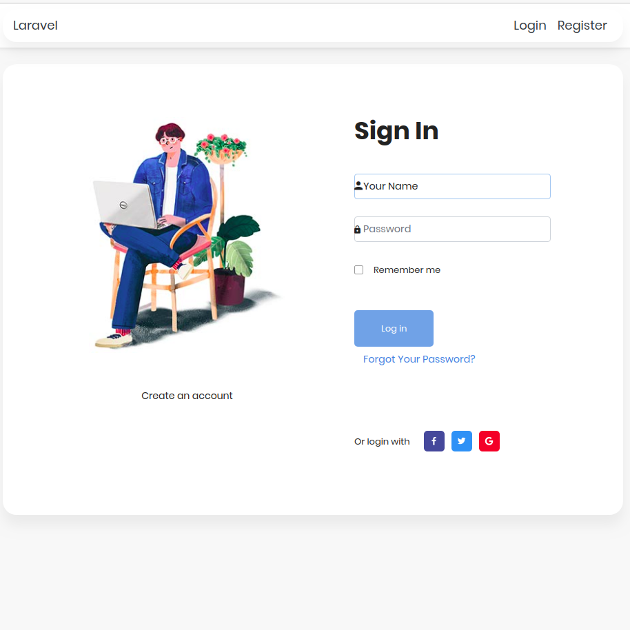
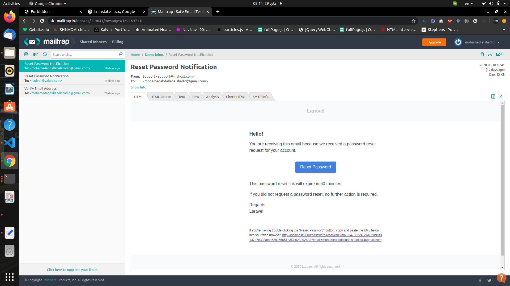

### -Admin Images
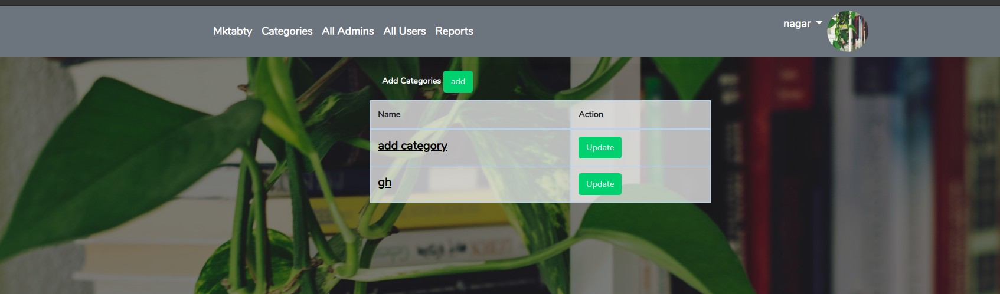
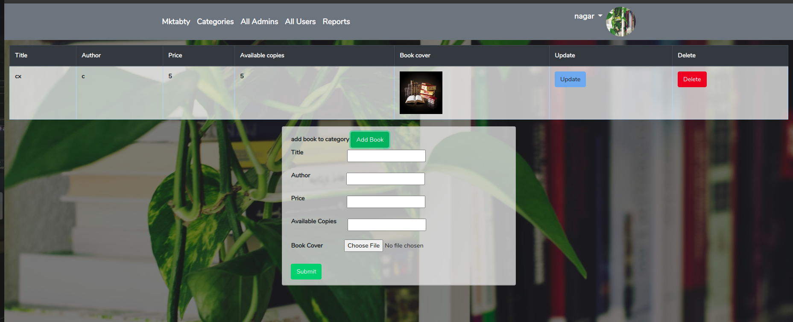

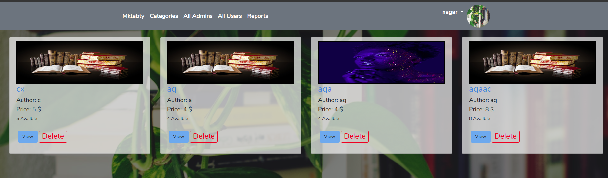
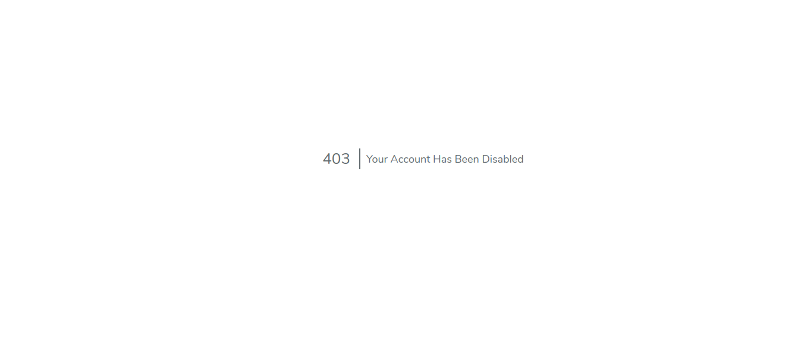
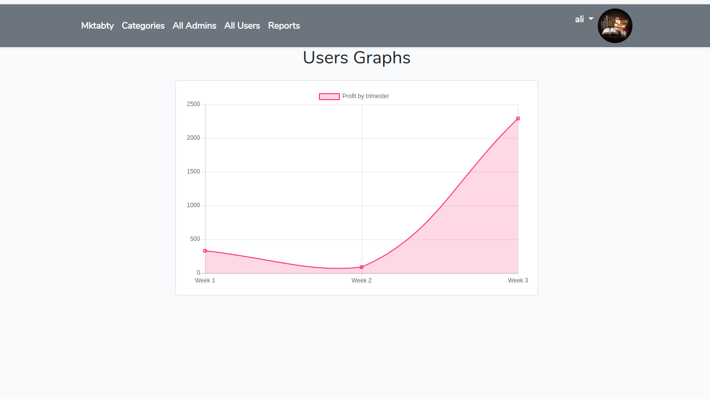

### -User Images
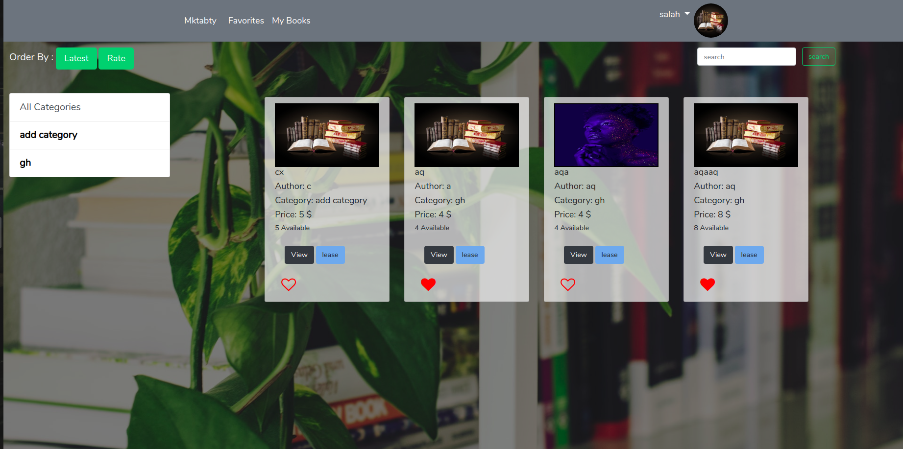
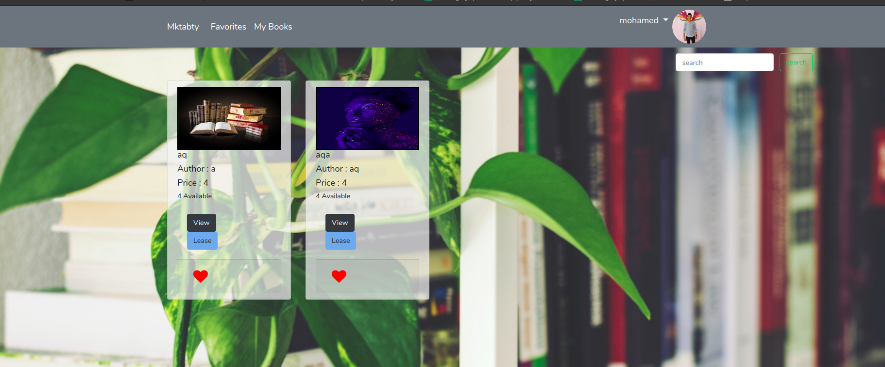
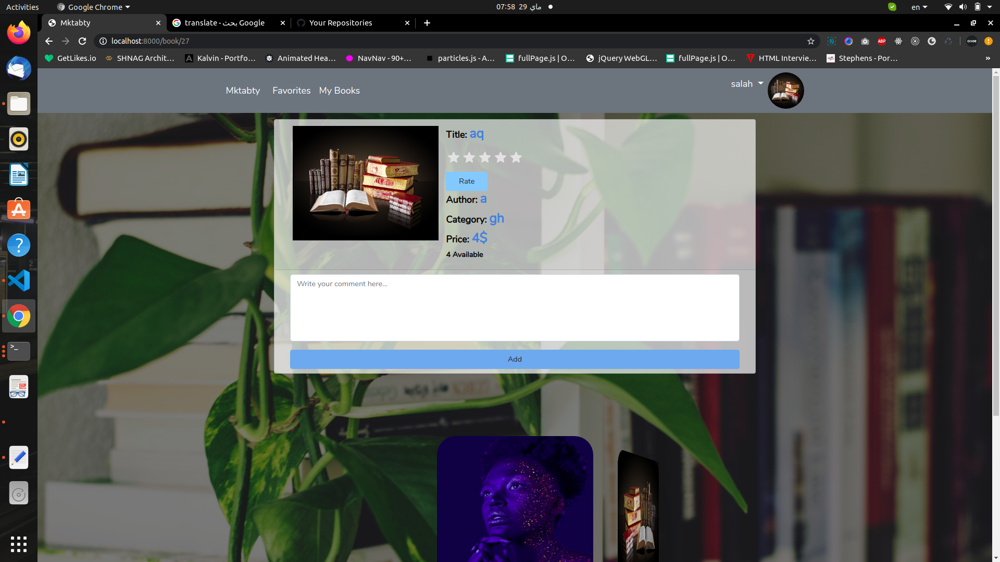
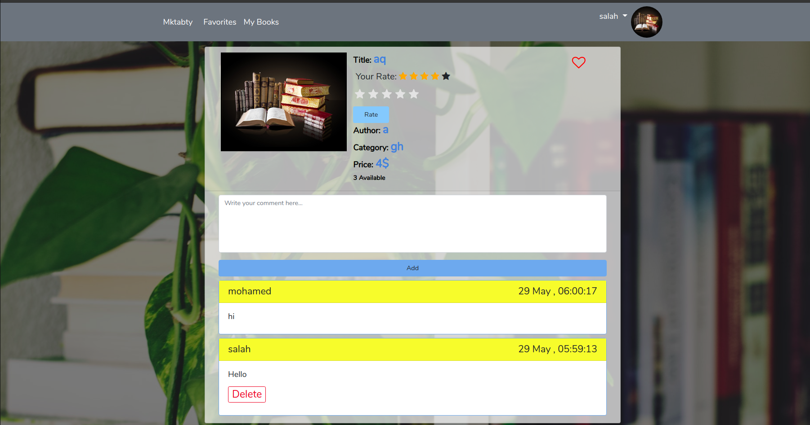
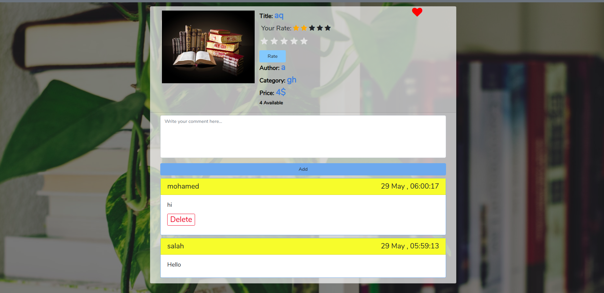

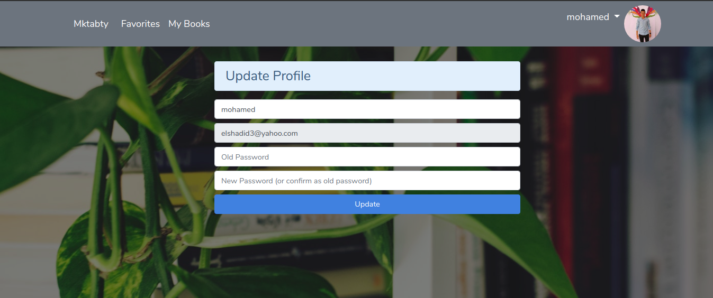

